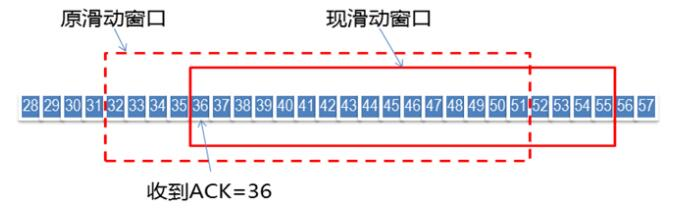
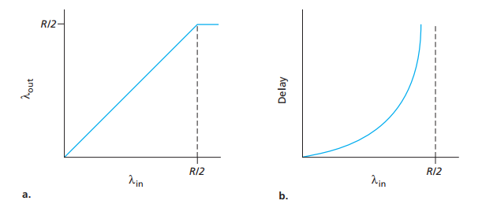
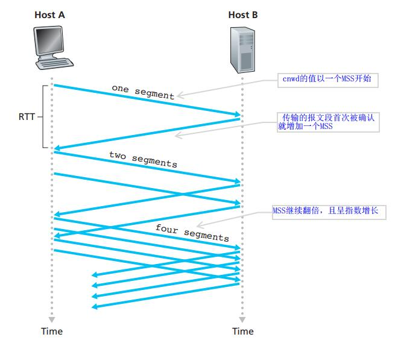

## 复习题

### 3.1 - 3.3 节

1.假定网络层提供了下列服务。在源主机中的网络层接受最大长度1200字节相来假定在目的主机上能够运地址的报文段。网络层则保证将该报文段交付给位于目的主机的运输层。假设在目的主机上能够运行许多网络应用进程。

a.设计可能最简单的运输层协议，该协议将使应用程序数据到达位于目的主机的所希望的进程。假设在目的主机中的操作系统已经为每个运行的应用进程分配了一个4字节的端口号。

b.修改这个协议，使它向目的进程提供一个的“返回地址”。

c.在你的协议中，该运输层在计算机网络的核心中“必须做任何事”吗？

> - 我们将这个协议称为STP。在发送方，STP从发送进程接收不超过1196字节的数据块、目标主机地址和目标端口号。STP向每个块添加一个四字节头，并将目标进程的端口号放入该头中。然后，STP将目标主机地址和生成的段提供给网络层。网络层将网段传送到目标主机上的STP。STP然后检查段中的端口号，从段中提取数据，并将数据传递给由端口号标识的进程。
> - 使用两个头字段：**源端口字段和目标端口字段**。在发送方，STP接受不超过1192字节的数据块、目标主机地址、源端口号和目标端口号。STP创建一个段，其中包含应用程序数据、源端口号和目标端口号。然后它将段和目标主机地址提供给网络层。在接收到段之后，接收主机上的STP向应用程序进程提供应用程序数据和源端口号。
> - 错误，运输层为运行在不同主机上的进程之间提供了逻辑通信。
>

2.考虑有一个星球，每个人都属于某个六口之家，每个家庭都住在自己的房子里，每个房子都一个唯一的地址， 并且某给定家庭中的每个人有一个独特的名字。假定该星球有一个从源家庭到目的家庭交付信件的部政服务。该部件服务要求:

 ①在一个信封中有一封信。

 ②在信封上请能地写上目的家庭的地址(并且没有别的东西)。假设每个家庭有一名家庭成员个代表为家庭中的其他成员收集和分发信件。这些信没有必要提供任何有关信的接收者的指示。

a.使用对上面复习题RI的解决方案作为启发，**描述**家庭成员代表能够使用的协议，以从发送家庭成员向接收家庭成员交付信件。

b.在你的协议中，该邮政服务必须打开信封并检查信件内容才能提供它的服务吗?

> 寄信时，家庭成员必须向代表提供**信件本身**、**目的地住址**和**收件人姓名**。代表把收件人的名字写在信的顶部。然后，代表将信放入信封，并在信封上写下目的地的地址。
>
> 然后代表把信交给地球的邮递服务。在收件端，代表从邮件服务处收到信件，从信封中取出信件，并记下写在信顶部的收件人姓名。然后把这封信交给代表。
>
> 不，邮件服务不必打开信封，它**只检查信封上的地址**。

3.考虑在主机A和主机B之间有一条TCP连接。 假设从主机A传送到主机B的TCP报文段具有源端口号x和目的端口号y。对于从主机B传送到主机A的报文段，源端口号和目的端口号分别是多少？

源端口号为y，目标端口号为x。

4.描述应用程序开发者为什么可能选择在UDP上运行应用程序而不是在TCP上运行的原因。

> - 应用程序开发人员可能不希望其应用程序使用TCP的**拥塞控制**，这会在拥塞时限制应用程序的发送速率。例如，IP电话和IP视频会议应用程序的设计者选择通过UDP运行他们的应用程序。
> - 不需要TCP提供的**可靠的数据传输**。
>

:::tip tcp udp的特点

- 关于何时、发送什么数据的应用层控制更为精细。采用UDP时，只要应用进程将数据传给UDP，UDP就会将此数据打包进UDP报文段并立即将其传递给网络层。而TCP有一个拥塞控制机制，以便当源和目的主机间的一条或多条链路变得极度拥塞是来遏制TCP发送方。一些应用对速率有要求，不希望过分延迟报文段的传送，且可以容忍数据丢失。
- 无需连接建立。TCP在开始数据传输之前需要经过三次握手，UDP却不需要任何准备即可进行数据传输。（经典案例：DNS）
- 无连接状态。TCP需要在端系统中维护连接状态。UDP则不需要。
- 分组首部开销小。每个TCP报文段有二十字节的首部开销，UDP只有8字节。

:::

5.在今天的因特网中，为什么语音和图像流量常常是经过TCP而不是经UDP发送。(提示:我们寻找的答案与TCP的拥塞控制机制没有关系。)

> 由于大多数防火墙被配置为阻止UDP通信，因此使用TCP进行视频和语音通信可以让流量通过防火墙。

6.当某应用程序运行在UDP上时，该应用程序可能得到可靠数据传输吗?如果能，如何实现?

> 可以。通过在**应用程序自身**中建立可靠性机制来完成（可通过**增加确认与重传机制**来实现）

7.假定在主机C上的一个进程有一个具有端口号6789的UDP套接字。假定主机A和主机B都用目的端口号6789向主机C发送一个UDP报文段。这两台主机的这些报文段在主机C都被描述为相同的套接字吗?如果是这样的话，在主机C的该进程将怎样知道源于两台不同主机的这两个报文段?R8. 假定在主机C端口80上运行的一个Web服务器。假定这个Web服务器使用持续连接，并且正在接收来自两台不同主机A和B的请求。被发送的所有请求都通过位于主机c的相同套接字吗?如果它们通过不同的套接字传递.这两个套接字都具有端口80吗?讨论和解释之。

>  是的，两个段都将定向到同一个套接字。对于每个接收段，在socket接口上，操作系统将为进程提供**IP地址**来确定各个段的来源。

### 3.4 节

9.在我们的rdt协议中，为什么需要引人序号?

> rdt2.0协议的一个致命缺陷，那就是**没有考虑ACK和NAK分组受损的可能性**，如果一个ACK或者NAK分组受损，发送方无法知道接收方是否正确接受了上一块发送的数据。

10.在我们的rdt协议中，为什么需要引人定时器?

> 底层信道会发生丢包，发送方会选择一个时间值，以判定**可能**发生了丢包，如果在这个时候没有收到ACK，则重传该分组。

11.假定发送方和接收方之间的往返时延是固定的并且且为发送方所知。假设分组能够丢失的话，在协认rd3.0中，一个定时器仍是必需的吗?试解释之。

> 在rdt3.0协议中仍然需要一个计时器。如果知道往返时间，那么唯一的优点是，**发送方确切地知道分组或分组的ACK（或NACK）已经丢失**，与实际场景相比，在实际场景中，ACK（或NACK）可能在计时器过期后仍在发送的途中。然而，为了检测丢失，对于每个包，在发送方仍然需要一个持续时间恒定的计时器。

### 3.5 节

14.是非判断题:

> - （**错误**）主机A经过一条TCP连接向主机B发送一个大文件。假设主机B没有数据发往主机A。因为主机B不能随数据捎带确认，所以主机B将不向主机A发送确认。
>
> - （**错误**）在连接的整个过程中，TCP的rwnd的长度决不会变化。
>
> - （**正确**）假设主机A通过一 条TCP连接向主机B发送一个大文件。主机A发送但未被确认的字节数不会超过接收缓存的大小。
> - （**错误**）假设主机A通过一条TCP连接向主机B发送一个大文件。如果对于这条连接的一个报文段的序号为m，则对于后继报文段的序号将必然是m+1。

关于**RWND**:

TCP通过让发送方维护一个**接收窗口**（received window）的变量来提供流量控制。

基本原理：

- 期望接收到的下一字节的序号n，该n代表接收方已经接收到了前n-1字节数据，此时如果接收方收到第n+1字节数据而不是第n字节数据，接收方是不会发送序号为n+2的ACK的。举个例子，假如接收端收到1-1024字节，它会发送一个确认号为1025的ACK,但是接下来收到的是2049-3072，它是不会发送确认号为3072的ACK,而依旧发送1025的ACK。

- 当前的窗口大小为m，如此发送方在接收到ACK包含的这两个数据后就可以计算出还可以发送多少字节的数据给对方，假定当前发送方已发送到第x字节，则可以发送的字节数就是**y=m-(x-n)**.

下面给出图示：

当前的窗口大小 m = 51 - 32 + 1 = 20

当前发送方已发送到字节 x = 51

期望接受到的下一字节的序号 n = 3

> - （**正确**）TCP报文段在它的首部中有一个**rwnd**字段。
> - （**错误**）假定在一条TCP连接中最后的SampleRTT等于1秒，那么对于该连接的TimeoutInterval的当前值必定大于等于1秒。
> - （**错误**）假设主机A通过一条TCP连接向主机B发送一个序号为38的4个字节的报文段。在这个相同的报文段中，确认号必定是42。

tcp的首部包含以下字段：

- 32Bit的**序号字段**和32Bit的**确认号字段**。这些字段被TCP发送方和接收方用来实现**可靠数据传输服务**。
- 16Bit的**接收窗口字段**。用于**流量控制**。
- 4Bit的**首部长度字段**，该字段指示了**以32Bit的字为单位的TCP首部长度**，由于TCP选项字段的原因，TCP首部长度是可变的。（通常选项字段为空，所以TCP首部的典型长度就是20Bit）
- 可选和变长的**选项字段**。用于发送方和接收方协商最大报文段长度时，或者在高速网络环境下用作窗口调节因子使用。
- 6Bit的**标志字段**，具体如下：

| 字段名 | 描述                                                   |
| ------ | ------------------------------------------------------ |
| ACK    | 用来指示确认字段中的值是有效的                         |
| RST    | 用于连接建立和拆除（三次握手、四次挥手）               |
| SYN    | 用于连接建立和拆除（三次握手、四次挥手）               |
| FIN    | 用于连接建立和拆除（三次握手、四次挥手）               |
| PSH    | PSH被设置的时候，就指示接收方应该立即将数据交给上层    |
| URG    | 用来指示报文段里存在着被发送端的上层实体置为紧急的数据 |

R15.假设主机A通过一条TCP连接向主机B发送两个紧接着的TCP报文段。第一个报文段的序号为90，第二个报文段序号为110。

a. 第一个报文段中有多少数据?

b. 假设第一个报文段丢失而第二个报文段到达主机B。那么在主机B发往主机A的确认报文中，确认号应该是多少?

- 20字节。（序号是该报文段首字节的字节流编号）

- 确认号是90。因为TCP提供的是**累计确认**, 只确认该流中至第一个丢失字节为止的字符。

R16. 考虑在3.5节中讨论的Telnet的例子。在用户键人字符C数秒之后，用户又键入字符R。那么在用户键人字符R之后，总共发送了多少个报文段，这些报文段中的序号和确认字段应该填入什么?

> 第一个报文段：客户 => 服务器 ，序号 43 确认号 80
>
> 第二个报文段：服务器 => 客户， 序号80 确认号 44（告诉客户端该发44了）
>
> 第三个报文段：服务器 => 客户， 序号44 确认号 81 (空数据)

### 3.7 节

17. 假设**两条TCP连接**存在于一个带宽为Rbps的瓶颈链路上。它们都要发送一个很大的文件(以相同方向经过瓶颈链路)，并且两者是同时开始发送文件。那么TCP将为每条连接分配什么样的传输速率?

    > **R/2**， 理由如下：
    >
    > 题设符合以下情况，即**两个发送方和一台具有无穷大缓存的路由器。**
    >
    > 如下图所示，（对于某一台主机）左边的图形描绘了**每连接的吞吐量**（per-connection throughput，接收方每秒接收的字节数）与**该连接发生速率**的函数关系。
    >
    > 
    >
    > 当发送速率为【0，R/2】时，接收方的吞吐量等于发送方的发送速率，即发送方发送的所有数据经有限时延后才到达接收方。然而当发送速率超过R/2 时，它的吞吐量只能达到 R/2 , 原因是**两条TCP连接共享链路容量**造成的。无论这两个主机将发送速率设置为多高，他们都不会看到超过 R/2 的吞吐量。

:::tip 拥塞网络的代价

如图b所示，它展示了以接近链路容量的速率运行时后果。当发送速率接近R / 2 时，路由器中的平均排队分组数目就会无限增长，源与目的地的平均时延也会变成无穷大。

:::

18. 是非判断题。考虑TCP的**拥塞控制**。当发送方定时器超时时，其ssthresh（慢启动阈值）的值将被设置为原来值的一半。

>  错误，它会被设置为**cwnd（拥塞窗口）值**的一半。

**关于TCP拥塞控制算法**

- **慢启动**

  在慢启动状态，cwnd（拥塞窗口）的值以一个MSS（最大报文段长度）开始。

  慢启动阶段思路是不要一开始就发送大量的数据，先探测一下网络的拥塞程度，也就是说由小到大逐渐增加拥塞窗口的大小，在没有出现丢包时每收到一个 ACK 就**将拥塞窗口大小加一**（单位是 MSS，最大单个报文段长度），每轮次发送窗口增加一倍，呈指数增长，若出现丢包，**则将拥塞窗口减半，进入拥塞避免阶段**。

  

  

- **拥塞避免**

  当窗口达到慢启动阈值或出现丢包时，进入拥塞避免阶段，窗口每轮次加一，呈线性增长；当收到对一个报文的**三个重复的 ACK** 时，认为这个报文的下一个报文丢失了，进入快重传阶段，要求接收方在收到一个失序的报文段后就立即发出重复确认（为的是使发送方及早知道有报文段没有到达对方，可提高网络吞吐量约20%）而不要等到自己发送数据时捎带确认。

- **快速恢复**

  快重传完成后进入快恢复阶段，将慢启动阈值修改为当前拥塞窗口值的一半，同时拥塞窗口值等于慢启动阈值，然后进入拥塞避免阶段，重复上述过程。

:::tip 快重传

快重传算法要求首先接收方收到一个失序的报文段后就立刻发出重复确认，而不要等待自己发送数据时才进行捎带确认。接收方成功的接受了发送方发送来的M1、M2并且分别给发送了ACK，现在接收方没有收到M3，而接收到了M4，显然接收方不能确认M4，因为M4是**失序的报文段**。如果根据可靠性传输原理接收方什么都不做，但是按照快速重传算法，在收到M4、M5等报文段的时候，不断重复的向发送方发送M2的ACK,如果接收方一连收到三个重复的ACK,那么发送方不必等待重传计时器到期，由于发送方尽早重传未被确认的报文段。

:::

19. 在3.7节的“TCP分岔”讨论中，对于TCP分岔的响应时间，断言大约是4 * RTT(FE) + RTT(BE) + 处理时间。评价该断言。

    > 4倍是表示用于建立TCP连接的RTTFE加上用于3个数据窗口的3个RTTFE。
    >
    > RTTFE表示客户与前端服务器之间的往返时间。
    >
    > RTTBE表示的是前端服务器与数据中心（后端服务器）之间的往返时间。